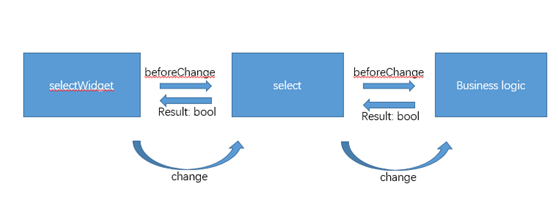

# ipc-web重构 （六） 基础组件建设

因为在ipc-web前端的需求中明确定义了各种UI组件的显示与交互方式，同时要求需要对IE8兼容(前端开发人员的噩耗)。所以为了高保真的还原这些设计，我们需要自己定制各种UI组件，例如弹窗类(包括confirm, alert, info)，select等。

#### UI组件

开发这些组件可以以jQuery插件的方式来进行拓展，而且github有相当多的优秀的jquery插件。要很好的利用这些资源，因为遇到问题可以很快的上面找到答案，同时可以向优秀的人学习他们的思维方式。

* jQuery插件拓展基本方式如下:

 ```javascript
 jQuery.fn.myPlugin = function() {
    // 插件代码
 }
 ```

 但是为了避免和其他库中的`$`冲突的话，可以将jQuery作为参数传递给一个自我执行的封闭程序，jQuery在此程序中映射为`$`符号，这样可以避免`$`号被其他库覆写，如：
 
 ```javascript
(function ($) {
    $.fn.myPlugin = function () {
        // 插件代码
    };
})(jQuery); 
 ```
 本项目的基础组件代码请查询select.js
 ```javascript
 (function($) {
     "use strict";

     var tmpSelect = {
         mainTemplate: '<div class="plugin-select">' +
             '<div class="selected"><span lang="en"></span></div>' +
             '<div class="triangle"></div>' +
             '<div class="slide">' +
             '<div class="slide-item-holder"></div>' +
             '</div>' +
             '<div class="expand-collapse"></div>' +
             '</div>',
         optionTemplate: '<div class="slide-item" xvalue=""><span lang="en"></span></div>',
         uniqueAttrKey: 'only-for-plugin-select',
         uniqueAttrValuePrefix: 'i-am-unique-',
         collapse: function(select) {
             select.removeClass("select-slide");
         },
         addSelectOptionElements: function(select, selectOptionElements) {
             var htmlStr = "";
             selectOptionElements.each(function(i) {
                 if ($(this).css("display") != "none") {
                     htmlStr += '<div class="slide-item" xvalue="' + 
                        $(this).attr("value") + '"><span lang="en">' + 
                        $(this).html() + '</span></div>';
                 };
             });
             select.find(".slide-item-holder").append(htmlStr);
         },
         addSelectOptionForOrigin: function(originSelect, selectOptionElements) {
             originSelect.append(selectOptionElements);
         },
         changeFromOrigin: function(select, originSelect) {
             originSelect.change(function() {
                 tmpSelect.feedSelectValue(select, originSelect);
             })
         },
         expand: function(select) {
             select.addClass("select-slide");
         },
         updateDisplayStyle: function(select, _options, originSelect) {
             var pluginSelectWidth = originSelect.width() == 0 ? 
                _options.pluginSelectWidth : originSelect.outerWidth();
             var maxDisplayContainerWidth = _options.optionWidth || pluginSelectWidth;
             var tmpSelectOptionHeight = _options.slideOptionHeight;
             var totalOptionHeightWithoutScroll = (tmpSelectOptionHeight + 8) * 
                select.find(".slide-item").length;
             var maxDisplayContainerHeight = Math.min(_options.slideMaxHeight, 
                totalOptionHeightWithoutScroll);

             if (undefined == pluginSelectWidth || pluginSelectWidth <= 30 ||
                 undefined == maxDisplayContainerWidth ||
                 undefined == tmpSelectOptionHeight || undefined == totalOptionHeightWithoutScroll ||
                 undefined == maxDisplayContainerHeight) {
                 console.error("args error for init plugin-select");
             };
             select.width(pluginSelectWidth);
             select.find(".selected").width(pluginSelectWidth - 30);
             select.find(".slide").width(maxDisplayContainerWidth)
                .height(maxDisplayContainerHeight);
             select.find(".slide-item").height(tmpSelectOptionHeight);
             select.find(".slide-item-holder").width(maxDisplayContainerWidth)
                .height(totalOptionHeightWithoutScroll);
             select.css("position", originSelect.css("position"));
             select.css("left", originSelect.css("left"));
             select.css("top", originSelect.css("top"));
         },
         generateAddedOptionElements: function(addedOptions) {
             if (undefined == addedOptions) {
                 return $("");
             };
             var optionPrefix = "<option>";
             var optionPostfix = "</option>";
             var htmlStr = "";
             for (var key in addedOptions) {
                 htmlStr += optionPrefix + key + optionPostfix;
             };
             return $(htmlStr);
         },
         feedSelectValue: function(select, originSelect) {
             var selectedValue;
             if (originSelect.val()) {
                 selectedValue = originSelect.find(":selected").html() || originSelect.val();
             } else {
                 selectedValue = originSelect.find("option:first").html();
             };

             select.find(".selected span").html(selectedValue);
         },
         feedTemplate: function(select, originSelect, options) {
             select.toggleClass("select-disabled", options.disabled);
             tmpSelect.feedSelectValue(select, originSelect);
         },
         generatePluginConstructOption: function(options, originSelect) {
             var _options = $.extend(true, {}, $.fn.Select.defaults, options)
             var optionWidth = originSelect.attr("select-width");
             if (optionWidth) {
                 _options.optionWidth = parseInt(optionWidth);
             };
             _options.disabled = originSelect.attr("disabled") == "disabled";
             return _options;
         },
         generateSelectId: function() {
             return tmpSelect.uniqueAttrValuePrefix + $.now() + Math.floor(Math.random() * 6);
         },
         onClick: function(select, e, originSelect) {
             var screenAvailableHeight = screen.availHeight;
             var selectPositionY = e.pageY;
             var slideContainer = select.find(".slide");
             if (screenAvailableHeight - selectPositionY < slideContainer.height()) {
                 slideContainer.css({
                     "bottom": select.height(),
                     "top": ""
                 });
             } else {
                 slideContainer.css({
                     "top": select.height(),
                     "bottom": ""
                 });
             };

             if (select.hasClass("select-slide")) {
                 select.removeClass("select-slide");
             } else {
                 $(".select-slide").removeClass("select-slide");
                 select.addClass("select-slide");
             }

             originSelect.focus();

             e.stopPropagation();
         },
         onOptionClick: function(select, e, originSelect, selectedOption) {
             select.removeClass("select-slide");
             var value = selectedOption.attr("xvalue");
             var selectedText = selectedOption.text();
             var oldText = select.find(".selected span").text();
             originSelect.val(value);
             if (oldText != selectedText) {
                 (function() {
                     originSelect.trigger("beforeChange");
                     return originSelect.data("canChange");
                 }).after(function() {
                     originSelect.change();
                     select.find(".selected span").text(selectedText);
                 })();
             };
             e.stopPropagation();
         },
         addScrollbar: function(select) {
             select.find(".slide").Scrollbar({
                 target: select.find(".slide .slide-item-holder")
             });
         }
     };

     var bodyClicking = false;

     $.fn.Select = function(options) {
         var originSelect = $(this);
         var _options = tmpSelect.generatePluginConstructOption(options, originSelect);

         var id = originSelect.attr(tmpSelect.uniqueAttrKey) || tmpSelect.generateSelectId();
         if ($("#" + id).length > 0) {
             $("#" + id).remove();
         };

         var select = $(tmpSelect.mainTemplate);

         select.attr("id", id);
         originSelect.attr(tmpSelect.uniqueAttrKey, id);

         var addedOptionElements = tmpSelect.generateAddedOptionElements(_options.addedOptions);
         tmpSelect.addSelectOptionForOrigin(originSelect, addedOptionElements);

         tmpSelect.feedTemplate(select, originSelect, _options);

         tmpSelect.addSelectOptionElements(select, originSelect.find("option"));

         tmpSelect.updateDisplayStyle(select, _options, originSelect);
         tmpSelect.addScrollbar(select);

         select.insertBefore(originSelect);

         select.on('mouseup', function() {
             bodyClicking = false;
         })

         $('.expand-collapse', select).on('click', function(e) {
             tmpSelect.onClick(select, e, originSelect);
         });

         $('.slide-item', select).on('mousedown', function(e) {
             tmpSelect.onOptionClick(select, e, originSelect, $(this));
         });

         tmpSelect.changeFromOrigin(select, originSelect);
         originSelect.hide();
         tmpSelect.collapse(select);

     };

     $.fn.Select.defaults = {
         pluginSelectWidth: 200,
         optionWidth: null,
         slideMaxHeight: 288,
         slideOptionHeight: 16,
         hotKey: false,
         disabled: false
     };


     $(document).on("mousedown", "body", function() {
         bodyClicking = true;
     });
     $(document).on("mouseup", "body", function() {
         if (bodyClicking) {
             $('div.select-slide').removeClass("select-slide");
         };
     });

 })(jQuery);
 ```
 以及msg.js。
 ```javascript
 (function($) {
     "use strict";

     $.ipc = $.ipc || {};

     var Msg = {
         ID: 0,
         mainTemplate: '<div >' +
             '<div class="window-msg-bg"></div>' +
             '<div class="window-msg-holder">' +
             '<div class="window-msg-contain">' +
             '<div class="window-msg-head">' +
             '<span class="window-msg-head-title" lang="en"></span>' +
             '</div>' +
             '<div class="window-msg-body">' +
             '<div class="window-msg-body-content"><span lang="en">' +
             '</span></div>' +
             '</div>' +
             '<div class="window-msg-body-foot">' +
             '</div>' +
             '</div>' +
             '</div>' +
             '</div>',
         closeIconTemplate: '<span class="window-msg-head-close"></span>',
         btnTemplate: '<input class="window-msg-btn" value="OK" lang="en" type="button" />',
         close: function(msg) {
             var context = msg.parent();
             $('body').unbind('keydown', Msg.hotClose);
             msg.remove();
             msg.option.afterClose();
             return context;
         },
         cancel: function(msg) {
             var context = msg.parent();
             msg.option.cancel();
             return Msg.close(msg);
         },
         confirm: function(msg) {
             var context = msg.parent();
             msg.option.confirm();
             return Msg.close(msg);
         },
         ok: function(msg) {
             var context = msg.parent();
             msg.option.ok();
             return Msg.close(msg);
         },
         hotClose: function(event) {
             if (event.keyCode == "27") {
                 Msg.close(event.data.msg);
             };
         }

     };

     $.ipc.Msg = function(options) {

         var _options = $.extend(true, {}, $.ipc.Msg.defaults, options);

         var id = "Msg-1";
         if ($("#" + id).length > 0) {
             $("#" + id).remove();
         }

         var rHtml = Msg.mainTemplate;
         var msg = $(rHtml);

         //render id, title, info, button and size
         msg.attr("id", id);
         $('.window-msg-head-title', msg).text(_options.title);
         $('.window-msg-body-content span', msg).html(_options.info);

         switch (_options.type) {
             case "alert":
                 $('.window-msg-body-foot', msg).append(Msg.btnTemplate);
                 $('.window-msg-btn:first', msg).attr("value", _options.btnOk);
                 $('.window-msg-btn:first', msg).attr("for", "ok");
                 break;

             case "confirm":
                 $('.window-msg-body-foot', msg).append(Msg.btnTemplate);
                 $('.window-msg-body-foot', msg).append(Msg.btnTemplate);
                 $('.window-msg-btn:first', msg).attr("value", _options.btnCancel);
                 $('.window-msg-btn:first', msg).attr("for", "cancel");
                 $('.window-msg-btn:last', msg).attr("value", _options.btnConfirm);
                 $('.window-msg-btn:last', msg).attr("for", "confirm");
                 break;

             case "info":
                 break;

             default:
                 $('.window-msg-body-foot', msg).append(Msg.btnTemplate);
                 $('.window-msg-btn:first', msg).attr("value", _options.btnOk);
                 $('.window-msg-btn:first', msg).attr("for", "ok");
                 break;
         }

         $('.window-msg-contain', msg).css({
             "width": _options.width,
             "height": _options.height
         });

         if (_options.closeIcon) {
             $('.window-msg-head', msg).append(Msg.closeIconTemplate);
         };

         _options.beforeInit();

         try {
             msg.appendTo('body');
         } catch (e) {
             console.log(e);
             console.log('can not append msg to body');
             return false;
         }

         msg.option = _options;

         // add object functions. so we can dynamic call these functions.
         msg.close = function() {
             Msg.close(msg);
         };

         msg.cancel = function() {
             Msg.cancel(msg);
         }

         msg.confirm = function() {
             Msg.confirm(msg);
         }

         msg.ok = function() {
             Msg.ok(msg);
         }

         $('.window-msg-btn', msg).on('click', function(e) {
             e.preventDefault();
             var type = $(this).attr("for");
             Msg[type](msg);
         });

         $('.window-msg-head-close', msg).on('click', function(e) {
             e.preventDefault();
             Msg.close(msg);
         });

         if (msg.option.hotKey) {
             $('body').bind('keydown', {
                 msg: msg
             }, Msg.hotClose);
         };

         return msg;
     };

     // make default options writable outside
     $.ipc.Msg.defaults = {
         type: "alert",
         title: "",
         info: "",
         html: "",
         btnConfirm: "Confirm",
         btnCancel: "Cancel",
         btnOk: "OK",
         width: 400,
         height: 260,
         hotKey: true,
         closeIcon: true,
         cancel: function() {},
         ok: function() {},
         confirm: function() {},
         beforeInit: function() {},
         afterClose: function() {}
     };
})(jQuery);
 ```

在使用select组件时，使用方式是现在html代码中写入原生态的select，然后后续封装的组件代码从页面中载入时自动根据原生态的select进行插件式select生成,换句话说，就是插件代码会在页面载入时对原生态的组件（例如select）打一个补丁，将原生态的组件隐藏，用户只会和我们封装定制好的组件交互。其中会进行一个双向绑定，操作封装组件会影响到原生态组件，代码操作原生态组件会反向影响封装的组件。controller中的监听事件均是在原生态的select上，这样就可以做到与封装的组件进行解耦，如果我们使用另外一个select插件，业务代码可以保持不变。

在使用封装select的时候遇到一个需求，即需要用户确认更改选择，该次select组件的change事件才生效，否则select原有值保持不变。封装select时产生的change事件传递如图：

 
用户看到的是selectWidget，那么当他触发change事件时，封装的selectWidget会触发原生态的select的change事件，业务逻辑得以执行。

值得一提的是，有一个特定的场景需要仔细思考设计一下：在业务逻辑中，有可能需要撤销selectWidget的change事件，也即是用户操作了selectWidget更换了它的值，但是也许这是一个非法操作（具体场景是用户在录制视频时切换分辨率的select，页面会提示是否确定中断录制视频，如果用户点击不中断的话，之前的selectWidget的change事件就是非法操作）需要撤销，将selectWidget的值恢复为原来的值。而此时controller的业务逻辑可以影响select（为了与selectWidget解耦），但是不能影响selectWidget（因为业务代码中不应该涉及到具体的封装，只涉及到原生态的select）。所以问题就是controller知道要恢复selectWidget的值，应该如何优雅的恢复。

解决方法是，在selectWidget触发change事件之前先触发beforeChange事件，这个事件可以决定是不是触发change(类似于window的onbeforeunload可以阻止unload事件一样)，事件驱动图如下：


#### 基础库

* 用于检测用户所使用的客户端浏览器类型与版本。
 ```javascript
 function findBrowserTypeVersion() {
     var ua = navigator.userAgent,
         tem,
         M = ua.match(/(opera|chrome|safari|firefox|msie|edge|trident(?=\/))\/?\s*(\d+)/i) || [];
     for (var ieVer = 0; ieVer < 12; ieVer++) {
         var b = document.createElement('b')
         b.innerHTML = '<!--[if IE ' + ieVer + ']><i></i><![endif]-->';
         if (b.getElementsByTagName('i').length === 1) {
             return "MSIE " + ieVer;
         };
     };
     if (/trident/i.test(M[1])) {
         tem = /\brv[ :]+(\d+)/g.exec(ua) || [];
         return 'MSIE ' + (tem[1] || '');
     }
     if (M[1] === 'Chrome') {
         tem = ua.match(/\bOPR\/(\d+)/);
         if (tem != null) return 'Opera ' + tem[1];
         tem = ua.match(/Edge\/(\d+)/);
         if (tem != null) return 'Edge ' + tem[1];
     }
     M = M[2] ? [M[1], M[2]] : [navigator.appName, navigator.appVersion, '-?'];
     if ((tem = ua.match(/version\/(\d+)/i)) != null) M.splice(1, 1, tem[1]);
     return M.join(' ');
 };
 ```

* 做跨域请求时IE8不能使用jQuery封装的ajax(xmlhttprequest)，只能使用xdr(xmldomainrequest)，所以需要做一个库能够提供接口兼容这两种不同的浏览器。
 ```javascript
 (function($) {
     "use strict";

     $.ipc = $.ipc || {};

     function ieXDomainAjax(options) {
         if (window.XDomainRequest == undefined) {
             console.error("no XDomainRequest in current browser");
             return;
         }
         var xdr = new XDomainRequest();
         if (xdr == undefined) {
             console.error("can not create XDomainRequest instance");
             return;
         };

         var newOptions = $.extend(true, {}, $.xAjax.ieXDomainAjaxDefaults, options);

         if (newOptions.url == undefined) {
             console.error("no url in ieXDomainAjax");
             return;
         };

         xdr.onerror = function() {
             (options.error || function(xdr) {})(xdr);
         }

         xdr.ontimeout = function() {
             (options.error || function(xdr) {})(xdr);
         }

         xdr.onload = function() {
             var response = $.parseJSON(xdr.responseText);
             (options.success || function(resp) {})(response);
         }

         xdr.onprogress = function() {
             (options.onprogress || function(xdr) {})(xdr);
         }

         if (newOptions.contentType.indexOf("x-www-form-urlencoded") >= 0) {
             newOptions.data = $.param(newOptions.data);
         };

         xdr.timeout = newOptions.timeout;
         xdr.open(newOptions.type, newOptions.url);
         xdr.send(newOptions.data);
     };

     function normalAjax(options) {
         var newOptions = $.extend(true, {}, $.xAjax.normalAjaxDefaults, options);

         if (newOptions.url == undefined) {
             console.error("options.url in undefined in normalAjax");
             return;
         }

         newOptions.beforeSend = function() {
             (options.beforeSend || function() {})();
         }
         newOptions.complete = function(xhr) {
             var ajaxContext = this;
             $.proxy((options.complete || function(xhr) {}), ajaxContext)(xhr);
         }
         newOptions.error = function(xhr) {
             (options.error || function(xhr) {})(xhr);
         }
         newOptions.success = function(response) {
             var ajaxContext = this;
             $.proxy((options.success || function(resp) {}), ajaxContext)(response);
         }

         var ajaxObj = $.ajax(newOptions);
         return ajaxObj;
     };

     var browserAjaxMap = {
         "MSIE 8": ieXDomainAjax,
         "MSIE 9": ieXDomainAjax,
         "MSIE 10": ieXDomainAjax
     };

     $.xAjax = function(options, xDomain) {
         var ajaxFunction = xDomainAjaxMap[xDomain] || normalAjax;
         var ajaxObj = ajaxFunction(options);
         return ajaxObj;
     };

     $.xAjax.normalAjaxDefaults = {
         type: "post",
         data: {},
         dataType: "json",
         cache: false,
         contentType: "application/json;charset=utf-8",
         headers: {
             Accept: "application/json, */*; version=1.0; charset=utf-8;"
         },
         timeout: 60000,
         async: true,
         global: false
     };

     $.xAjax.ieXDomainAjaxDefaults = {
         timeout: 60000,
         type: "post",
         data: {}
     };

     $.xAjax.defaults = {
         xType: "xDomain"
     };

     var xDomainStr = $.xAjax.defaults.xType;
     var xDomainAjaxMap = {};
     xDomainAjaxMap[xDomainStr] = browserAjaxMap[$.ipc.Browser.prototype.type + ' ' + $.ipc.Browser.prototype.version] || normalAjax;
 })(jQuery);
 ```

* 字符串版本比较。部分需求需要针对字符串类型的版本号进行比较大小。
 ```javascript
 $.ipc.compareVersion = function versionCompare(v1, v2, options) {
     var defaultOptions = {
         lexicographical: false,
         zeroExtend: true
     };
     var _options = $.extend(true, defaultOptions, options);
     var lexicographical = _options && _options.lexicographical,
         zeroExtend = _options && _options.zeroExtend,
         v1parts = v1.split('.'),
         v2parts = v2.split('.');

     function isValidPart(x) {
         return (lexicographical ? /^\d+[A-Za-z]*$/ : /^\d+$/).test(x);
     }

     if (!v1parts.every(isValidPart) || !v2parts.every(isValidPart)) {
         return NaN;
     }

     if (zeroExtend) {
         while (v1parts.length < v2parts.length) v1parts.push("0");
         while (v2parts.length < v1parts.length) v2parts.push("0");
     }

     if (!lexicographical) {
         v1parts = v1parts.map(Number);
         v2parts = v2parts.map(Number);
     }

     for (var i = 0; i < v1parts.length; ++i) {
         if (v2parts.length == i) {
             return 1;
         }

         if (v1parts[i] == v2parts[i]) {
             continue;
         } else if (v1parts[i] > v2parts[i]) {
             return 1;
         } else {
             return -1;
         }
     }

     if (v1parts.length != v2parts.length) {
         return -1;
     }

     return 0;
 };
 ```


