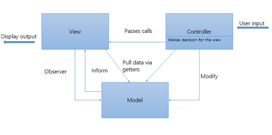

# ipc-web重构 （四） 我的MVC

前端的业务日益复杂，在面向对象编程的基础上需要一个良好的架构来管理和组织各个不同的模块，进行分工协作，完成复杂的任务。

而MVC模式就是一个良好的解决方案。它区分了模型，表现，以及响应用户输入的三个不同的类：
* Model用于管理数据的行为，传递数据模型的状态给view，以及更改数据模型的状态。
* View用于展现model的各种信息。
* Controller用于接收用户事件，然后通知model和view进行改变。

经典的MVC模型如下：


 
在经典MVC模型基础上有两个变种：

* 被动式MVC，流程图如图：  
   
 Controller响应事件，通知model更改状态，然后通知view去更新显示。在这种模式中Model完全独立于controller和view，所以它自己更新状态的时候无法通知到其他模块。

* 主动式MVC，如图：  
   
 使用Observer的接口来对model和view进行解耦。那么model通知view的方式如下:  
 

#### 我的MVC

开始设计前端重构的时候，是想基于MV * 方式进行，提议使用开源的框架例如backbone，angular等进行重构，但是因为以下原因而被否决：

1. 使用开源框架有学习摸索的成本，所以在时间管理上不符合预期。
2. 使用开源框架来重构会改动太大，毕竟如果使用angular，完全颠覆了jquery，所以会有较大的风险。
3. 开发门槛高，不利于任务继承与分配。

于是最终的结果是先参照普适用的MVC模式进行优化，成熟之后再考虑转为angularJS。被动式MVC太过于简单，不适用于我们目前比较复杂的前端场景。于是我们需要主动式MVC来进行前端的重构。

设计出来的各个模块如图：  
  
其中View用于不同类型的展示。Model用于保存数据状态，Controller抉择该使用何种view。特别地：我们将ajax异步获取数据状态的业务放置在Model中。这样做的好处是能够在不同的页面内使用相同的model，然后可以复用该异步更新状态的业务。

#### 代码片段
* Model  
 Model类，在该基类中封装了两个方法，一个是异步获取数据更新自身状态的方法，一个是封装的validate成员属性类。
 * makeAjaxRequest方法
 ```javascript
 Model.prototype.makeAjaxRequest = function(inputArgs, xDomain) {

        if (undefined == inputArgs["url"] || undefined == inputArgs["data"] || 
            undefined == inputArgs["changeState"]) {
            console.error("args error in makeAjaxRequest");
            return;
        };

        var tmpCallbacks = this.extendErrorCodeCallback(inputArgs["callbacks"]);
        var currentModel = this;

        var ajaxOptions = {
            url: inputArgs["url"],
            data: inputArgs["data"],
            success: function(response) {
                var errCodeStrIndex = inputArgs["errCodeStrIndex"] || "errorCode";
                var noErrorCode = inputArgs["noErrorCode"] || 0;
                var defaultErrorCode = inputArgs["defaultErrorCode"] || -1;

                if (response[errCodeStrIndex] == noErrorCode) {
                    var changeStateFunc = $.proxy(inputArgs["changeState"], currentModel);
                    changeStateFunc(response);
                }
                var callbackFunc = tmpCallbacks.errorCodeCallbackMap[response[errCodeStrIndex]] || 
                    tmpCallbacks.errorCodeCallbackMap[defaultErrorCode];
                callbackFunc(response);
                if (tmpCallbacks.commonCallback) {
                    tmpCallbacks.commonCallback();
                };
            },
            error: function(xhr) {
                tmpCallbacks.errorCallback(xhr);
                if (tmpCallbacks.commonCallback) {
                    tmpCallbacks.commonCallback();
                };
            }
        };

        $.extend(true, ajaxOptions, inputArgs["extendAjaxOptions"]);

        return $.xAjax(ajaxOptions, xDomain);
    };
 ```
 * validate方法
 ```javascript
 Model.prototype.validateAttr = function(inputArgs) {
        if (undefined == inputArgs["attr"] || undefined == inputArgs["attrEmptyMsg"] ||
            undefined == inputArgs["maxLength"] || undefined == inputArgs["minLength"] ||
            undefined == inputArgs["attrOutOfLimitMsg"] || undefined == inputArgs["pattern"] ||
            undefined == inputArgs["patternTestFailMsg"]) {
            console.error("args error in validateAttr");
            return;
        };
        var e = new $.ipc.Error();
        if (0 == inputArgs["attr"].length) {
            e.code = false;
            e.msg = inputArgs["attrEmptyMsg"];
        } else if (inputArgs["attr"].length > inputArgs["maxLength"] || 
            inputArgs["attr"].length < inputArgs["minLength"]) {
            e.code = false;
            e.msg = inputArgs["attrOutOfLimitMsg"];
        } else if (!inputArgs["pattern"].test(inputArgs["attr"])) {
            e.code = false;
            e.msg = inputArgs["patternTestFailMsg"];
        } else {
            e.code = true;
            e.msg = "OK";
        };
        return e;
    };
 ```
* Controller  
 Controller类：内部封装两个方法，一个是addHandler接口，用于绑定DOM事件，通常外部不需要调用。
 * addHandler方法 (注意：这个方法仅在类内部使用)
 ```javascript
 BaseController.prototype.addHandler = function(inputArgs) {
        var currentController = this;
        var getMsgInformed = inputArgs["getMsgInformed"];
        var selector = inputArgs["selector"];
        var eventName = inputArgs["eventName"];

        $(document).on(eventName, selector, function() {
            var data = null;
            if (getMsgInformed) {
                data = $.proxy(getMsgInformed, this)();
            };
            var argumentsArr = arguments;
            currentController.domClickCallbacks.fire(selector, eventName, data, argumentsArr);
        });
    };
 ```
 * batchInitHandler。供外部使用的绑定事件的接口。
 ```javascript
 BaseController.prototype.batchInitHandler = function(appendedSelectorHandlerMap, 
    selectorMsgProduceFuncMap) {
        if (undefined == appendedSelectorHandlerMap ||
            undefined == selectorMsgProduceFuncMap) {
            console.error("args error in batchInitHandler");
        };

        $.extend(true, this.selectorHandlerMap, appendedSelectorHandlerMap);

        for (var selector in appendedSelectorHandlerMap) {
            var args = {};
            args["selector"] = selector;
            args["getMsgInformed"] = selectorMsgProduceFuncMap[selector];
            for (var eventName in appendedSelectorHandlerMap[selector]) {
                args["eventName"] = eventName;
                this.addHandler(args);
            };
        };
    };
 ```  
 使用用例如下：
 ```javascript
 SoftwareController.prototype.initHandler = function() {
        var appendedSelectorHandlerMap = {
            "#ipc-arrow-left": {
                "click": this.turnMenuLeft
            },
            "#ipc-arrow-right": {
                "click": this.turnMenuRight
            },
            ".download-menu-cell": {
                "click": this.gotoFaq
            }
        };

        var selectorMsgProduceFuncMap = {
            ".download-menu-cell": function() {
                return $(this).attr("faq-path");
            }
        };
        this.batchInitHandler(appendedSelectorHandlerMap, selectorMsgProduceFuncMap);
    };
 ```  
 这样页面就监听了$(“#ipc-arrow-left”)元素上的click事件，并使用turnMenuLeft进行响应。
 