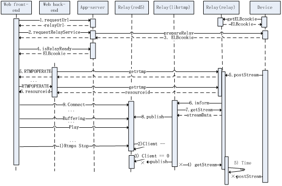
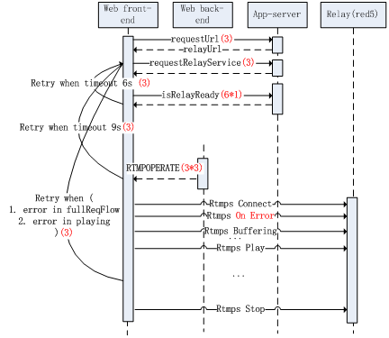
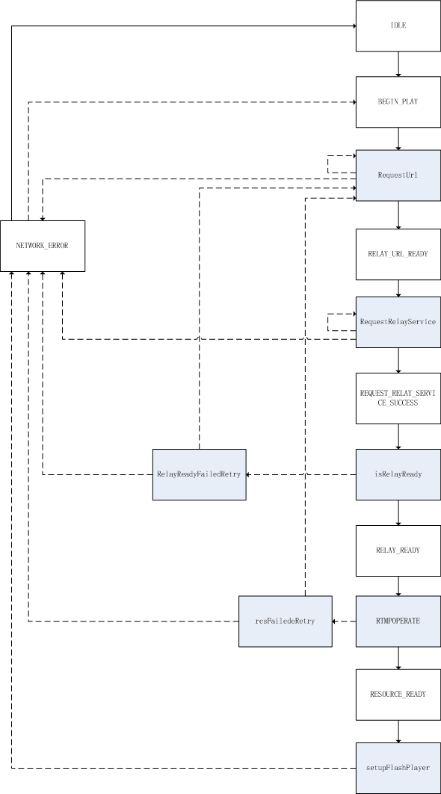

# ipc-web重构 （七） 技术亮点

在重构时会遇到各种需求，这就使得我去思考一些比较好的解决方法。于是在解决问题的过程中出现了一些亮点。有一部分的理念是来源于后台的MVC框架，java的springMVC。

#### 方法执行链

单一职责是设计原则中的一个简单而重要的原则。通常一个方法只为了完成一个简单的业务。举个例子来说，对超链接的a节点点击事件之后的业务逻辑应该只有跳转页面。但是在上一章提到的一个场景：有可能这个跳转操作是一个非法操作，不应该被执行。那么通常的做法是在这个跳转的逻辑中加一个判断，如果本操作合法则跳转，非法则不跳转:

```javascript
function sample() {
    // business logic
}
```

变成

```javascript
function sample() {
    var r = confirm("Are you sure?");
    if(r) {
        // business logic
    }
}
```

这样做不符合单一职责，在sample中做了两个业务逻辑，也不符合开放-关闭原则：例如在合法和非法的判断条件变化时需要进入代码进行更改。

一个好的解决方法是利用面向切面的概念形成一个方法执行链。我们将跳转逻辑的方法作为一个切面点，切面点之前的操作方法A、切面点B、切面点之后的操作方法C形成一个方法执行链，A成功之后执行B，B成功之后执行C。如果其中一个失败则后续的操作不执行。

```javascript
function sample() {
    // business logic
}
```

变成：

```javascript
function sample() {
    // business logic
}
sample = (sample || function() {}).before(function() {
    return confirm("Are you sure?");
});
```

其中切面before和after的代码如下：
```javascript
(function() {
    Function.prototype.before = function(func) {
        var _self = this;
        return function() {
            if (func.apply(this, arguments) === false) {
                return false;
            };
            return _self.apply(this, arguments);
        }
    };

    Function.prototype.after = function(func) {
        var _self = this;
        return function() {
            var ret = _self.apply(this, arguments);
            if (ret === false) {
                return false;
            };
            func.apply(this, arguments);
            return ret;
        }
    };
})();
```

#### Js中的协程

协程的概念是将函数或者方法暂停在一个点(yield)，然后下次调用的时候继续从暂停点执行。举例：

```javascript
function* foo(){
    var index = 0;
    while (index <= 2)
        yield index++;
}
```
 
上述代码定义了一个协程方法，定义完成之后可以通过迭代器方式使用：

```javascript
var iterator = foo();
console.log(iterator.next()); // { value: 0, done: false }
console.log(iterator.next()); // { value: 1, done: false }
console.log(iterator.next()); // { value: 2, done: false }
console.log(iterator.next()); // { value: undefined, done: true }
```

有了协程之后，异步的代码就可以用同步的方式写了：

#### 流程设计

在flash直播方案中，从用户开启观看，到音视频到达用户浏览器端有一个比较复杂的请求流程，如图：



该流程中详细描述了两个处理流。

* 开启RTMP直播流  
 1 WEB前端发起requestUrl请求,获取relay地址。  
 2 WEB前端发起requestRelayService请求，app-server(devs-server)启动设备中relayd进程。  
 3 Device返回elbcookie至app-server(devs-server)。  
 4 WEB前端发起isRelayRelay请求，获得设备连接的Relay服务的AWS elbcookie。  
 5 Device开始POST多路或单路流至relay；Web前端通过web后台中转发送getrtmp请求至relay，轮训获得A/V的resourceid。  
 6 Relay获取流成功后生成resourceid，并通知librtmp。  
 7 Librtmp获取通知后，向relay发送get请求获取流。  
 8 Librtmp publish流至red5。  
 9 Web前端尝试RTMP连接，成功后即播放直播流。

* 关闭直播流  
 1) Web前端将rtmp流状态置为stop。  
 2) Red5计数将客户端数目减一。  
 3) Red5捕捉client数目为0的事件，停止librtmp的publish。  
 4) Librtmp捕捉publish被停止事件停止向relay发送get请求。  
 5) Relay监听设备POST超时事件，停止响应设备的POST请求。

前端处于应用顶端，受网络因素影响较大，请求超时比较常见，同时因为上述交互流程较为复杂，一步错则步步错，所以健壮的超时及错误回调策略比较重要。前端针对超时及错误的重试如下图：



1. 针对requestUrl和requestRelayService如果未取回正确结果(包括xhr超时，网络错误等)，会重新发送该请求最多3次。
2. IsRelayReady请求轮训每1秒一次，总共6s之内未取回正确结果则重新从requestRelayService开始尝试，此类型重试限制为3次。
3. RTMPOPERATE请求轮训每3秒一次，9秒内未正确取回结果，则重新从requestRelayService开始尝试，此类型重试限制为3次。
4. 在请求的过程中出现1.请求流中出现异常(已完成小循环重试，内部循环重试)，2.视频播放中出现异常(异常complete，网络错误，publish中断等)，均会进行大循环重试。
5. 网页视频播放器直播视频，中途出现网络错误，异常终止时，页面显示网络错误提示。

#### 状态机 

这些设计具体到代码上就是前端实现了一个状态迁移机。状态通过某个方法进行状态迁移，具体的状态迁移如图：



其中白色背景的长方形表示状态，灰色背景长方形表示方法。实线表示成功时迁移方向，虚线代表错误发生时的迁移方向。
