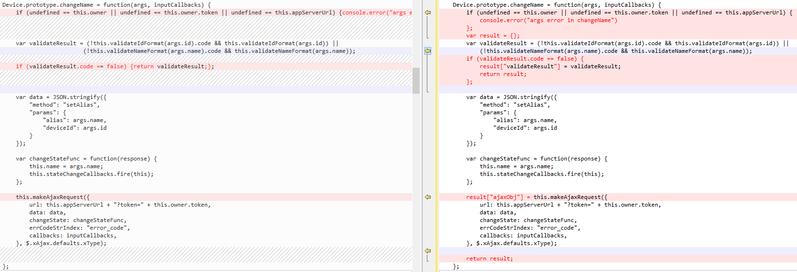

# 聊聊重构后的web

前端代码重构至今，除了一些需要与后台联调的接口之外，已经覆盖了所有的现有云平台的所有业务代码。但是大部分代码均处于自测阶段，并未经过测试部的测试流程。不过幸亏的是，主要核心的业务已经经过测试部分几轮提测并运行在正式版中。基于正式版和自测版的这些区别形成这份文档。同时还会介绍一下重构后的前端代码的改进与不足，以及后续更改的方向。

#### 正式版与自测版的区别

早在前端需要实现flash部分的需求时，我就决定将这部分重构版本的代码来代替已有代码，主要是基于以下考虑：

1. 架构上不合适，已有代码面向过程，难以拓展和复用。之前的架构是页面拥有一个全局变量admin，然后用它的属性值来保存需要通信的数据，用方法属性来定义过程。

 * 首先流程一旦确定，动态的更改流程将会非常复杂，例如在flash播放中flash和img播放大部分地方相同，除了不需要轮训getrtmp，以及在播放完成时需要killclient之外和flash均一致。已有代码可以完成任务，只是需要在部分流程中判断一下是否img播放环境，但是这样一判断的话，后续如果img环境支持flash播放，那么需要对这个函数更改，去掉判断部分。针对这种情形，结合当前的开发场景，我只能想到用面向对象的继承和多态去解决。而且流程固定，不适应快速的开发，加减流程中的某一个步骤都需要更改业务代码。
 * 其次全局变量相当危险，任何代码均对其属性进行更改，难以控制。
 * 全局变量不易维护，我思考了一下如果要使用这个方法来实现flash中的流程，全局变量的属性可能需要增加40-50个，这是什么概念，就是你过了一个星期再去看这个代码，你会发现你就不认识这个变量了。还有就是新人接手代码的时候，他需要40-50个分身去跟踪了解各个变量。
 * 最后每个ajax请求代码都相当难以复用，因为其中包含了这个流程更迭部分，已经具体到了下一步应该做什么（可以去看看getMyList接口）。

2. 两份代码维护一个业务。之前由于需要在chrome和edge浏览器上（后续统称为CE环境）显示一个不支持的提示，遵守开关-关闭原则的话，最小改动是在所有业务代码的运行之前判断用户环境，如果是CE环境，则运行新的代码。你问我为什么不在同一份代码维护，因为这个改动需要在关键函数（getMylist完成后的回调）中加环境判断，代码侵入性非常大。于是乎在一个新的js代码中需要实现大量与之前的tpcamera-admin.js相同的业务，只有少量的业务（i.e.播放视频时提示和省去插件下载与更新的提示）。这样做了之后，后患无穷。在tpcamera-admin.js中更改和新增的业务在CE环境中需要更新。经常出现改了A忘了B，难以控制一致性。为此出了多个bug。（看到这个就知道旧代码得有多难改，一个这么小的需求，我们都宁愿开新的逻辑环境来完成，更勿论复杂N倍的的flash,img播放了）。
3. 改动非常大，不如新写一个，况且已经完成了一部分了。已经写完其他页面了，模块和业务的划分会更加清晰，我相信可以写好。

所幸不辱使命，这部分最核心的代码还是完成并经过在年前提测。其中出了很多BUG，我需要在这里解释一下：

1. 大部分bug是功能性的bug，即未完成某个需求，详情请见bugzilla中关于插件观看的大部分bug。

 * 首先这个是可以避免的，我完全可以在判断用户的环境的之后让不同环境的用户进入不同的页面。CE环境运行重构的代码，非CE环境使用之前稳定的代码（tpcamera-admin.php）。这样至少可以规避10+的bug。
 * 其次，我是贪心的。我要在一个页面的逻辑中完成account管理、flash播放，img播放，插件播放。这样后续需求更改就不用维护两份代码（重构部分和tpcamera-admin部分）。所以出bug是可预见的，因为我一个人完成这个事情时间有限，未充分自测。  
 基于易维护、易拓展和便于交接我认为出这些bug的代价是值得的。
2. 对不同的机型配置理解有歧义，部分机型配置成mixed，实际上还是双路码流上传。
3. 踩了插件的坑。前端和插件的通信方式是：插件在js中是一个对象，前端需要传递什么值过去就是给这个对象的特定属性赋值，例如将设备的本地信息传入，这样插件就可以尝试本地播放视频。而插件对象的这些属性在前端是不可见的，例如`console.log(pluginObj.clddevid)`输出是`undefined`。
 
 * 我在给插件属性赋值时，未区分IE插件和非IE插件，直接赋值，导致bug。即有些属性streamtype、streamresolution、audiostreamtype不能给IE插件赋值，只能给非IE插件赋值。
 * 我在调用函数前会习惯性的判断该函数方法是否存在，同样调用插件方法时判断了一下，就直接导致该方法没有调用。

4. 未详细的阅读文档，接口返回值中带有协议头，而自以为不带协议头，虽然自测时没有出现问题。

##### 正式版与重构版相同的地方

从文件的角度上来说有以下文件是一致的(肯定不是完全一样，比如说目录结构的变化导致CSS中引用资源的变化，接口区别等等)：

* admin-common.css（资源路径区别）
* admin.css（资源路径区别）
* ipc-jwplayer-skin.css （完全一样）
* jquery-ui.min.css（完全一样）
* msg.css （资源路径的区别）
* product-img.css （资源路径的区别）
* admin.js （接口字段变化）
* ipc-basic-libs.js （完全一样）
* ipc-info-libs.js （重构版本增加了几条提示）
* 公共库（完全一样，包括jquery-ui-1.11.4.custom.min.js，jwplayer.flash.swf， jwplayer.js， jwpsrv.js）
* msg.js （仅做了代码风格上的更改）

##### 正式版与重构版不同的地方

* 目录结构
* 与后端的php代码解耦
* 接口变动（因为后台更改，所以接口有些不一样）
* POST提交的数据类型不一样，正式版是form表单形式，重构版是json形式
* ipc-business-libs.js中改动有：
 * linkie数据缓存管理。  
  ```javascript
  Device.prototype.getLocalLinkieData
  Device.prototype.updateLocalLinkieDataList
  Device.prototype.isNeedGetLinkie
  ```  
 * linkie解析。注意没有linkie接口的设备请求音视频的url均使用兼容模式（/stream/getvideo 和 /stream/getaudio）。同时非CE环境不能使用插件播放时，尝试使用flash播放。  
  ```javascript
  Device.prototype.getProductFromLinkieData // 入口
  Device.prototype.getOrderedPlayerTypeArr
  Device.prototype.dynamicFixPostChannelForMjpeg
  Device.prototype.getPlayerTypeAndPostChannel
  Device.prototype.getMultiPostDataChannel
  Device.prototype.getMixedPostDataChannel
  Device.prototype.getSupportResArr
  ```  
 * 获取linkie接口  
  ```javascript
  Device.prototype.getLinkie
  ```  
 * _所有请求后台接口的方法，返回值有变动_ （注意，此处改动比较大）。之前的这些方法返回用户输入验证结果或者空。现在不仅返回验证结果，同时返回发送ajax的js对象，用于查看和控制ajax。以设备的changeName为例：  
   
 * 用户模块中与后台交互的接口有增加。正式版上的重构代码因为只为admin页面服务，所以省略了很多用户模块的接口。现在这个用户模块也会用到像index等页面，所以接口有所增加，增加列表如下：  
  ```javascript
  User.prototype.register
  User.prototype.login
  User.prototype.sendActiveEmail
  User.prototype.resetPassword
  User.prototype.forgotPassword
  User.prototype.getUser
  User.prototype.encryptText
  ```  
 * 非插件播放和插件播放流程中均针对linkie做了细微改动。正式版的代码流程在技术亮点中有介绍。现在要在这个流程中新增linkie的步骤。在getRelayUrl的同时获取设备的linkie信息，均成功则继续后面的流程，否则内部重试3次，仍然失败的话大循环重试3次。插件播放类似，改动为：  
  ```javascript
  // NonPluginPlayer
  NonPluginPlayer.prototype.getRelayUrl
  =>
  NonPluginPlayer.prototype.getUrlAndLinkie
  
  // PluginPlayer
  PluginPlayer.prototype.getDeviceLocalInfo
  =>
  PluginPlayer.prototype.getLinkieAndLocal
  ```  
 * 抽象插件播放和非插件播放方式的同一个基类，用于共享和linkie相关的方法。
  ```javascript
  (function($) {
      "use strict";

      $.ipc = $.ipc || {};

      function MyPlayer() {
          $.ipc.Model.call(this, arguments);
          this.device = null;
          this.playerObj = null;
          this.stateChangeCallback = $.Callbacks("unique stopOnFalse");
      };

      $.ipc.inheritPrototype(MyPlayer, $.ipc.Model);

      MyPlayer.prototype.multiAsyncRequest = function(args) {
          $.when.apply($, args.ajaxArr).always(args.always).done(args.success).fail(args.fail);
      };

      MyPlayer.prototype.getDeviceLinkieData = function(callbacks) {
          var _self = this;
          var device = _self.device;
          if (device && device.owner.token && device.appServerUrl) {
              if (device.isNeedGetLinkie()) {
                  var result = device.getLinkie({
                      "id": device.id,
                      "token": device.owner.token,
                      "appServerUrl": device.appServerUrl
                  }, callbacks)["ajaxObj"];
                  return result;
              };
          };
      };

      $.ipc.MyPlayer = MyPlayer;

  })(jQuery);
  ```  
 * 等等等，正式版使用的admin的git版本号为ceb631a5，后续改动可以查阅git仓库）。
* 除admin页面之外均只属于自测
* admin页面中后续更改了以下地方  
 * admin.js中只是字段名变化（做过一次代码风格整理，同时因为请求后台接口的方法返回值有改动，做了相应的更改）
 * 从php变成html（资源路径不一致，php代码在返回html之前先判断了session信息）
 * css中只有资源引用位置的更改。

#### 重构后得到的改进与不足

前端的代码的重构周期已经告了一个段落。现在我可以从我的角度来对它进行定论。好与不好暂时只有我自己知道。我就从我自己的使用经验来总结一下。

##### 重构代码取得的改进。
* 从面向过程到面向对象。较大程度的提升了代码的可复用和易维护与可拓展。使用前人总结的面向对象的编程原则(S.O.L.I.D)，可以很好地编写代码。同时使用MVC的架构，可以清晰的每个部分的职责与合作方式。Model用于存储数据和DAO，Controller则监听用户输入，控制view和model做相应的更改，View控制显示方式。
* 解决缓存问题，定制发布规则。已有代码在版本更新时只会在获取CDN资源的时候会带上部署时的时间戳，这样只能解决新代码不会使用旧文件的问题，而不能解决旧代码会使用新文件的问题。于是重构的时候会在文件名称上带上文件指纹（内容的md5值）。这样可以充分的利用缓存，同时还不会导致错误的缓存使用。同时我们还可以制定发布规则，使得开发环境和生产环境目录结构不一样，例如我们可以将静态文件的代码发布至带有版本信息的路径上，之后cdn维护就可以针对性的删除旧版本的文件。
* 性能提升。fis3的构建过程带来的性能提升是非常明显的，可以对静态文件进行压缩（甚至可以内联），节省服务器带宽，减少客户端的请求次数。
* 有管理复杂流程的能力。不管是其中步骤的复用，还是增/删步骤。由于状态机的引入，可以解耦每个步骤，方便的管理或复用每个步骤。
* html模板的模板化开发。提取出公共模板进行统一维护。在离线发布的时候完成这些html模板的继承与拓展。
* 多语言的拓展。保留了多语言的接口，可动态的一键切换语言，动态的加载语言包，完成之后替换语言。

##### 重构代码还有哪些不足
* 前端代码的组件化开发。前端的需求日益复杂，可能是一个团队在开发维护，存在多人协同合作完成任务，那么组件化开发相当必要。关于前端代码的组件化，可以看[这里][1]。
* 模块管理工具来按需异步加载。有AMD和CMD两种规范分别由requirejs和seajs实现。前者编译时决定依赖并加载运行，后者先加载，动态执行。
* 自适应，往web-app的方向发展。大势所趋吧，对于这方面我还没有什么研究。
* 没有找到一个合适的对象私有变量实现方法。所有的对象数据成员变量均对外可见。
* 从admin页面可以看出：大部分的代码还是在于View中控制显示流程和执行的DOM操作。需要从这个方向获得优化。
* CSS编写需要预处理框架。我们需要less或者sass，来为 CSS 增加一些编程的的特性，无需考虑浏览器的兼容性问题，例如你可以在 CSS 中使用变量、简单的程序逻辑、函数等等在编程语言中的一些基本技巧，可以让你的 CSS 更见简洁，适应性更强，代码更直观等诸多好处。

##### 重构代码中未完成部分
* 需要额外处理flash在setupPlayer中可能会遇到的setup的问题，例如未安装flash等，需要做相关的回调显示提示等。
* 多语言所有显示文本的html标签中需要lang="en"属性，可能有未完成的地方。同时因为多语言可能会导致排版变动等。
* 需求中未提到的。当用户在使用linux系统的浏览器时，该如何提示给用户告知环境不支持播放？

##### 未来涉可能的变动
* 不仅仅是CE环境使用flash播放，所有环境使用flash或者img。此时应该修改`Device.prototype.getOrderedPlayerTypeArr`的环境判断与返回值。


 
[1]: http://www.zhihu.com/question/29735633?sort=created
